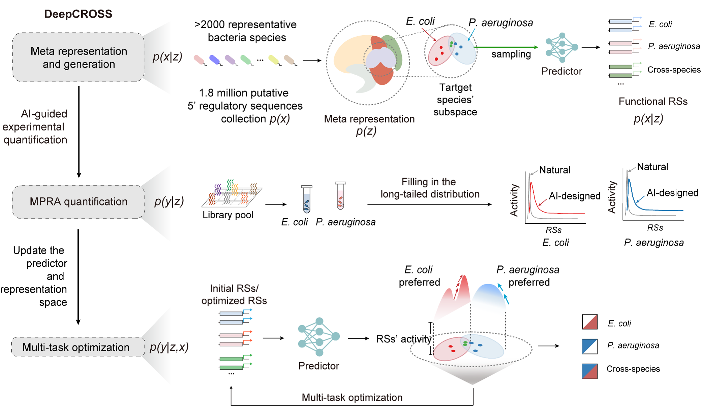

# DeepCROSS


DeepCROSS is a package built on top of [TensorFlow 1.14](https://www.tensorflow.org/)
designed to provide simple, composable abstractions for machine learning
research.


# Contents
 
[1. Introduction](#Introduction)   
 
[2. Environment Setup](#2)  
 
[3. Design cross-species regulatory sequences](#3)   

[4. License](#4)   


# Introduction
DeepCROSS is a generative inverse design tool for cross-species and species-preferred 5' regulatory sequences (RSs) in bacteria. By constructing the meta representation of 1.8 million 5’ RSs from thousands of bacterial genomes, DeepCROSS extracts the fundamental sequence features into a statistical embedding and forms the species-specific subspaces.


We validated the DeepCROSS-designed RSs by massively parallel reporter assay experiments. The DeepCROSS model refined by this strategy demonstrated a significant improvement in predicting RS activity performance. The experimental validation confirmed that the final DeepCROSS model achieved 83.3% and 75.0% accuracy in designing species-preferred and cross-species RSs respectively. These synthetic RSs exhibited high diversity and low sequence similarity to their natural counterparts within bacterial genomes.


# Environment Setup
DeepCROSS is on TensorFlow 1.14, and it can be installed using pip:
```shell
$ pip install tensorflow==1.14
```
You can run the following to verify things installed correctly:

```python
import tensorflow as tf
print("TensorFlow version {}".format(tf.__version__))
```
After configuring the tensorflow environment, you can install DeepCROSS by running following command in python:

```python
$ import DeepCROSS
```
# Design cross-species regulatory sequences
DeepCROSS is composed of a number of modules that can be imported as follows:
- `Generative model and representation`
- `Evaluation`
- `Predictive model`
- `Optimization`

## Generation and representation 

DeepCROSS offered a number of built in modules that you can trivially use. For
example to define a generative model based on AAE we can use the `AAE_semi_maxpooladd_2spe` module to call a default AAE model:

```python
gen = crosspro.Generators.AAE_semi_maxpooladd_2spe(log_dir=log_dir,nbin=nbin)
```

We highly recommend that you put your input files with the same directory of DeepCROSS package, thus you can directly run the generative_model.py to generate candidate sequences: 

```python
python generative_model.py -seq seq_path -train sequence-activity_train -test sequence-activity_test
```
The `seq_path` refers to the path of the sequence file in fasta format, and the `sequence-activity_train` and `sequence-activity_test` are the name of the sequence-activity paired file for training and test, respectively. An example of `sequence-activity_train` or `sequence-activity_test` is as follows:
~~~
ATAGCAGCTTCTGAACTGGTTACCTGCCGTGAGTAAATTAAAATTTTATT 132.5
TAATTTTTATCTGTCTGTGCGCTATGCCTATATTGGTTAAAGTATTTAGT 65.7
~~~

The output directory will be created automatically as follows:
~~~
/output  
    ├── generative_model  
    ├── designed_sequences 
    ├── evaluation  
    │   ├── basic_statistic
    │   ├── latent_representation
    │   └── Gradient  
    ├── genetic_algorithm    
    │   ├── predictor_weight_dir_evalu
    ├── designed_sequences  
    ├── predictor_trainop  
    └── predictor_evaluop      
~~~


## Evaluation
DeepCROSS supports multiple evaluation metrices for AI-deisgned regulatory sequences: kmer frequency and GC content distribution, latent space distribution visualization, similarity with natural genomes[2]. All of these metrices are implemented in the `evaluation.py` file.

```python
python evaluation.py
```
The output figures of kmer frequency and GC content distribution, latent space distribution visualization, similarity with natural genomes are all shown in the 
`./output/evaluation` folder.

## Prediction

Similarly, one can run the predictive model:

```python 
python predictive_model.py -dataset dataset_path
```
The `dataset_path` refers to the path of the sequence-activity file in npy format. The sequence-activity file could contain similar content as `sequence-activity_train`, but in npy format.

To optimize the regulatory sequences, one can run the multi-task optimization model using genetic algorith (GA):

## Optimization

```python
python optimization.py -save_freq_GA 10 -MaxIter 5000
```
The default optimization parameters have been shown above. The parameter `save_freq_GA` is the frequency of saving the GA results. The parameter `MaxIter` is the maximum number of iterations of the GA.


# License
For academic use, this project is licensed under the MIT License (see the LICENSE file for details). For commercial use, please contact the authors.

## Reference
[1] cblaster: a remote search tool for rapid identification and visualization of homologous gene clusters, Bioinformatics Advances, Volume 1, Issue 1, 2021, vbab016, https://doi.org/10.1093/bioadv/vbab016

